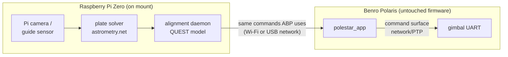
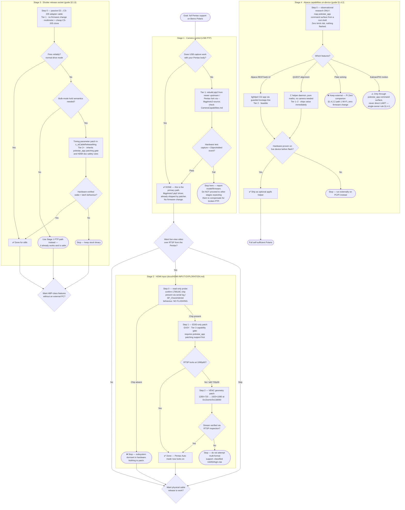
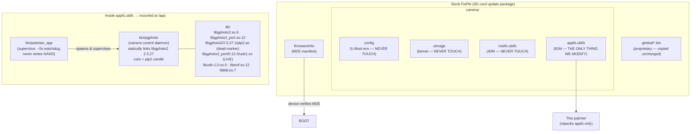
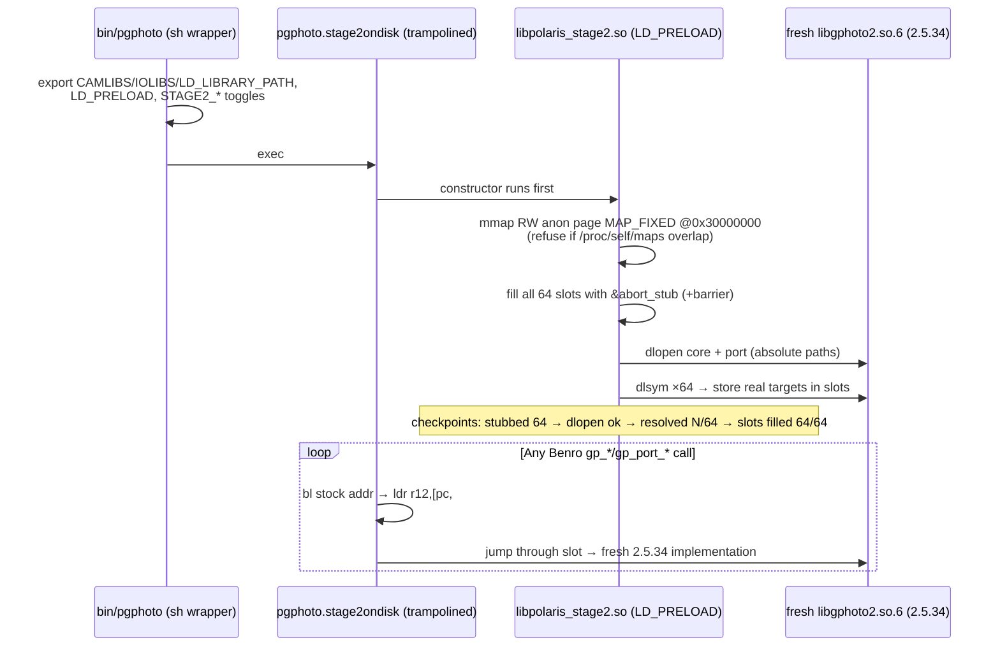
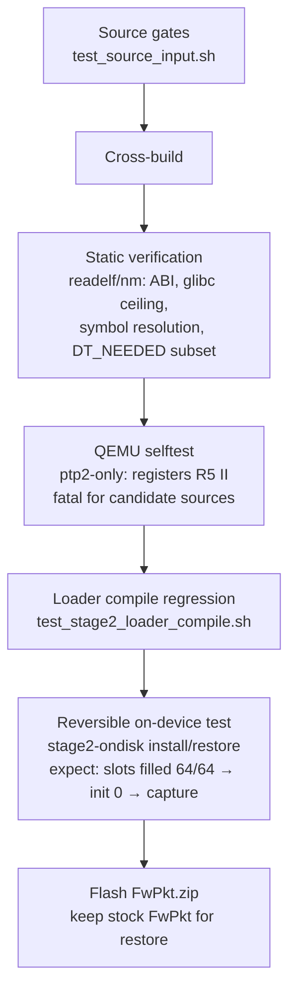
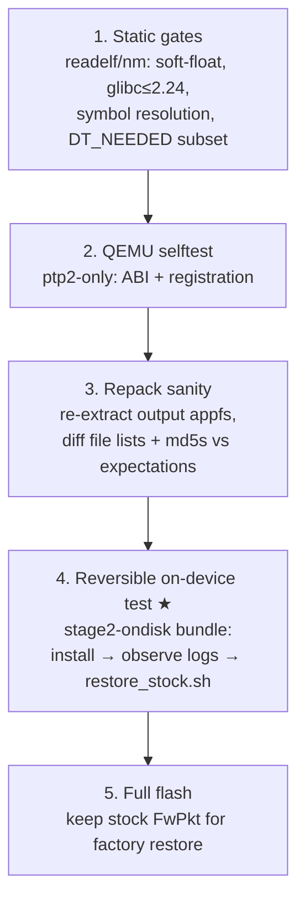
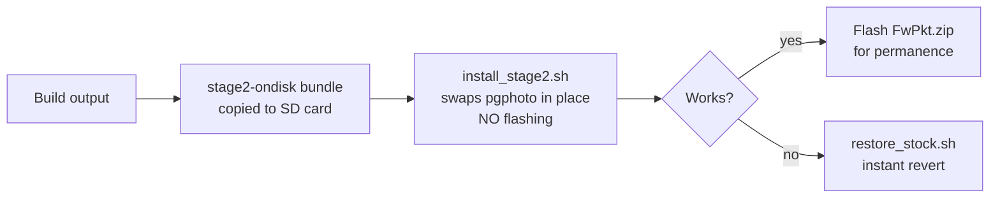
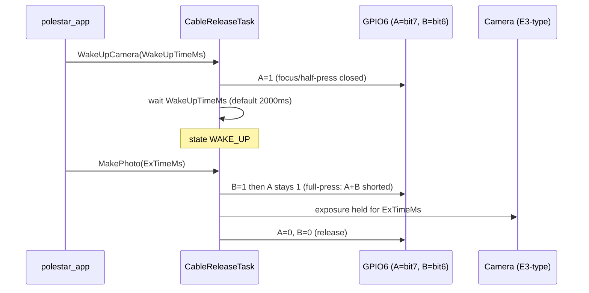
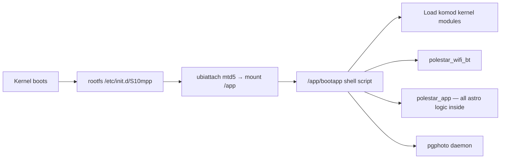

# Benro Polaris Firmware — Development & Maintenance Guide

**Audience:** future maintainers, including agents picking this project up cold.
**Status:** documents patcher state as of FwVer `4.0.0.32`, libgphoto2 target `2.5.34`, full mode hardware-verified.
**Companion docs:** [README](../README.md) · [HOW-IT-WORKS](HOW-IT-WORKS.md) · [TESTED](TESTED.md) · [NOTICE](../NOTICE) · [CameraCapabilities](../CameraCapabilities.md)

This guide has two sections:

1. **Project Manager view** — what the product does today, what we can safely amend or enhance functionally, what is off-limits.
2. **Technical Architect view** — how everything hangs together: firmware structure, build pipeline, patch mechanics, safety gates, and the "never touch" list with reasons.

> ## ⚠️ Prime directive: never brick the device
>
> Every design decision in this project is subordinate to one rule: **the hardware must always remain recoverable.** In practice this means:
>
> 1. **U-Boot, U-Boot env, kernel, rootfs, gimbal blobs are byte-for-byte untouchable** — they are the recovery path. A true brick requires corrupting them; we never do.
> 2. **Flashing is mediated by U-Boot + MD5 verification**, not userspace — a bad image is refused or recoverable by re-flashing stock.
> 3. **Never flash untested changes.** The `stage2-ondisk` bundle tests patched binaries on real hardware with zero NAND writes; `restore_stock.sh` reverts instantly.
> 4. **Archive your stock FwPkt permanently** — it is the only unbrick tool needed.
> 5. **Fail-closed checks are never bypassed.** If the pipeline aborts, that is protection working, not an obstacle.
>
> Full analysis: §2.12 Brick-risk analysis · Testing ladder: §2.11.

---

# Section 1 — Project Manager

## 1.1 What the product does

The Polaris is a gimbal/camera controller whose camera-control app (`polestar_app`) drives cameras through `/app/bin/pgphoto` (a statically-linked libgphoto2 2.5.27 fork). Stock firmware cannot properly drive modern cameras — concretely the Canon EOS R5 Mark II: capture hangs, cold connect takes ~3 minutes.

This project produces a **custom flashable firmware package** (`FwPkt.zip`) that replaces the whole libgphoto2 stack with a fresh 2.5.34 build plus a small set of surgical binary patches. Result on real hardware: instant detection, settings that stick, live view, no "no card" warning, capture that downloads JPEG + RAW.

## 1.2 Feature areas — amend / enhance / never touch

### ✅ Safe to amend or enhance

| Area | What can change | Notes |
|---|---|---|
| **libgphoto2 version** | Build any 2.5.x release via `--libgphoto2` | Must pass ABI/glibc-ceiling verification; the tool fails closed automatically. |
| **Camera driver support (new models)** | Rebuild ptp2 from newer upstream or a fork (e.g. Pentax fork via `--libgphoto2-source`) | This is the primary enhancement path. Driver capability matrices live in the libgphoto2 repo (`docs/pentax/…`), not here — see [CameraCapabilities.md](../CameraCapabilities.md). |
| **R5 II compatibility shims** | The three env-gated shims in `stage2_loader.c` (storage display, tethered-capture force) | Model-gated fail-closed; extend only behind the same gate pattern + hardware test. |
| **EOS-init error tolerance** | `container/dbg_patch.py` (POLARIS_DBG) source edits to LGPL code | Documented modification, shipped in `out/licenses/`. Extend only for specific transient errors observed on hardware. |
| **Cold-start reliability** | `resetUsb` neutralisation, skip eager file scan | Already minimal; changes must keep the ≤14-byte budget and symbol-discovery approach. |
| **On-device test bundle** | `stage2-ondisk/` install/restore scripts | Purely additive tooling; always reversible. |
| **Build tooling / launchers** | `patch-polaris.sh`, `.ps1`, Docker image, container scripts | MIT-licensed project code; free to improve. |
| **Documentation & provenance** | Docs, license output, source-provenance reporting | Keep LGPL corresponding-source shipping intact — it's a legal requirement. |

### ⚠️ Amend only with hardware testing

- **Full-mode trampoline mechanism** (`stage2_patch.py`, `stage2_loader.c`): slot base address, trampoline encoding, loader startup order. Every prior variant that deviated crashed on the Hi3559V200 kernel. QEMU does **not** reproduce those failures.
- **Repack parameters**: UBIFS geometry is read from the stock image on purpose. Hard-coding values risks an unflashable image.
- **New firmware versions**: anything other than `4.0.0.32`. The tool aborts on pattern mismatch by design — treat an abort as "needs reverse-engineering", not "loosen the check".

### 🚫 Never touch

| Item | Why |
|---|---|
| **U-Boot** (`u-boot.bin`) and U-Boot env (`camera/config`) | U-Boot performs the SD-card flash. Overwriting it removes the recovery path — a bad image becomes unfixable. |
| **Kernel** (`camera/uImage`) | No need; huge brick risk; breaks the "userspace-only" trust story. |
| **rootfs.ubifs** | Contains system libs (incl. `libudev`) the patched stack depends on; untouched = provably present. |
| **Gimbal blobs** (`gimbal/*.bin`) | Proprietary motor control; no understanding of it; copying through unchanged only. |
| **factoryParam / userParam NAND partitions** | Calibration/user data; not in the FwPkt at all — keep it that way. |
| **Benro proprietary code** (`polestar_app`, `pgphoto` internals beyond the documented byte sites, `_Camera` tail contents) | We ship no decompiled/proprietary content. Only interop *sizes* and public-API boundaries are used. |
| **The ~5s `polestar_app` watchdog assumption** | Never lengthen `camera_init` beyond it (e.g. longer OpenSession timeout) — causes crash-loop respawn. |
| **License obligations** | Always ship exact corresponding LGPL source in `out/licenses/`; never redistribute Benro firmware. |
| **`bin/polestar_app` inside appfs.ubifs** (today) | The patcher never modifies this binary — fail-closed by design. Any future change (e.g. HDMI EDID/VENC patches per [HDMI-INPUT-EXPLORATION.md](HDMI-INPUT-EXPLORATION.md), cable-release timing per §2.13) is a significant patcher capability change requiring verified backup/restore, checksum handling and a tested recovery route first. |

## 1.3 Functional roadmap candidates

1. **More camera models** — rebuild from newer upstream/fork; validate per-model with the reversible on-device bundle before flashing.
2. **Card-mode capture for R5 II** — currently forced to Internal RAM because card-mode `ObjectAddedEx` isn't delivered. If a future core delivers the event, relax shim #2/#3.
3. **Generalise shims** — replace hard-coded R5 II model gate with a per-camera policy table *only* as each model is hardware-tested.
4. **Firmware version support** — re-run symbol discovery against new stock builds; expect the fail-closed checks to catch drift.
5. **Self-test coverage** — extend QEMU selftest where possible, but remember full-mode behaviour is only provable on hardware.

## 1.4 Non-camera extension surface

Almost all non-camera functionality on the device is closed (proprietary `polestar_app`, gimbal blobs, rootfs/kernel). The realistic extension points are:

| Surface | Possible | Constraint |
|---|---|---|
| **pgphoto wrapper** (`container/ondisk/pgphoto.wrapper`) | Pre/post-processing around every camera-control session: logging, telemetry to `/app/sd/`, env tuning | Runs under the ~5s watchdog — must stay fast; keep it a plain POSIX sh script. |
| **Stage2 loader** (`stage2_loader.c`) | Additional constructor-time behaviour beyond camera shims | Every addition needs hardware validation; QEMU does not reproduce loader failures. |
| **Extra files in appfs** | Repack can add files (e.g. glibc-2.24/soft-float diagnostic tools) | Nothing auto-launches them — `polestar_app` has no plugin mechanism and cannot be modified. Only reachable via ADB/shell or the wrapper. |
| **SD-card tooling** (`/app/sd/`) | Backup/restore utilities, log collectors, config profiles read by the wrapper | Zero firmware risk; same pattern as the reversible bundle. |

Off the table: gimbal/motor features, UI/app features, system services/networking/storage (rootfs/kernel), PTPIP/Wi-Fi server changes.

Autostart nuance: `bootapp` is a plain shell script in appfs that we already repack, so a *guarded* launch line (`[ -f /app/helper ] && /app/helper &`) is technically trivial. It was classified conservatively because a broken `bootapp` means no services start — but the device remains flash-recoverable via stock FwPkt, so this is Tier-2 risk, not banned. See §1.4.2 for why this matters.

### 1.4.1 Mount movement — what can and can't be tweaked

All mount movement logic (star tracking, moon tracking, goto/slew) lives inside the compiled `polestar_app` binary (see §2.14 for where). We have no source, so movement is **driven, not edited**, in three tiers:

| Tier | Approach | Risk |
|---|---|---|
| 1 — safe | Exercise PTP properties polestar_app already supports (e.g. star-track speed, astrotracer timer) from our own client tooling; wrap pgphoto sessions with move-aware automation (pause capture during slew) | None — no firmware change |
| 2 — real work | Reverse-engineer the gimbal UART protocol (structured packets observed: `gotoAu yaw/pitch/roll`, upgrade frames); prototype purely observationally from a root shell/telnet on a live device — zero brick risk since nothing is flashed; ship an optional helper daemon in appfs once proven | Low during research; helper launch still requires manual start (no autostart hook) |
| 3 — never | Binary-patching `polestar_app` beyond trivial validated constants; touching gimbal MCU firmware (`polaris403/413_*.bin`) or U-Boot/env/kernel | High / absolute ban |

### 1.4.2 Alpaca Benro Polaris (ABP) — what could be pushed into firmware

[alpaca-benro-polaris](https://github.com/ogecko/alpaca-benro-polaris) is a third-party open-source Python driver that runs on an **external PC** and exposes the Polaris as a standard ASCOM Alpaca telescope/rotator over the network. Its v2.0 feature set is substantial: 3-axis PID motion control, Kalman filtering, multi-point alignment (QUEST algorithm), motor-speed calibration, roll-preserving GOTOs, and non-sidereal tracking of planets, satellites and comets.

**Key architectural insight:** ABP contains no secret hardware access. All the intelligence runs host-side on the PC; the mount only receives ordinary position/rate commands through its existing network control surface. Therefore *anything ABP can do from outside could in principle run inside* — the device already has `lighttpd` (HTTP server), the full astronomy maths library (`sp_astro`, §2.14), and an editable `bootapp` launch point.

Feature-by-feature portability:

| ABP feature | Push to firmware? | Why |
|---|---|---|
| Alpaca REST API / Pilot web app | ✅ Feasible | `lighttpd` already present; serve a small CGI/FastCGI app launched via guarded `bootapp` line |
| GoTo + sidereal/lunar/solar tracking | ⚠️ Partially exists | `polestar_app` already does goto/moon-track internally; exposing it needs the PTP/network command surface ABP itself uses |
| Rotator / roll preservation on GOTO | ⚠️ Depends | Needs raw 3-axis moves — same command surface ABP uses remotely |
| Multi-point alignment (QUEST) | ✅ Feasible | Pure quaternion maths, portable to C; needs plate-solve input |
| Kalman filter + PID motion control | ⚠️ Feasible but risky | Proves mount accepts velocity-level commands; an on-device version must go *through* `polestar_app`'s command surface, never around it (single-owner UART rule, §1.4.1 Tier 3) |
| Plate solving | ❌ Unrealistic on-device | ASTAP-class solver + index files exceed Hi3559 RAM/CPU; keep external |
| Satellite/comet catalogs (32k+ objects, JPL fetch) | ❌ Keep external | Needs internet access + storage the device lacks |

Honest caveats for a junior agent:

1. **Single-owner problem** — `polestar_app` owns the gimbal UART. An on-device Alpaca server must drive the mount exactly as ABP does remotely, through polestar_app's exposed commands.
2. **Effort** — porting a mature Python project onto an embedded ARM board with no Python runtime means C/C++ rewrites: weeks of work, not days.
3. **ABP as reference, not dependency** — this project remains external tooling; nothing here changes our anti-brick posture. The realistic path is: research the command surface observationally (Tier 2, zero brick risk), then decide which features justify an appfs helper.

#### 1.4.2.1 Roadmap: plate solving & improved alignment on-device

Plate solving needs star images, a reference catalogue, and CPU/RAM. The Hi3559V200 (~2GB RAM, Cortex-A7 cores) cannot run ASTAP-class solvers with full index files — but it has its own camera sensor and existing image pipelines (`mstitching`, `sp_starsky_stack`). Recommended staging:

| Level | What | Dependency | Risk |
|---|---|---|---|
| 1 | QUEST multi-point alignment model in C as an appfs helper daemon. Needs **no camera** — sync points come from manual centering / existing single-star align. Corrects tripod tilt, cone error, polar misalignment (most of ABP's alignment value) | None beyond command surface | Tier 1–2 |
| 2 | On-device plate solve using the Polaris's own sensor: capture wide-field frame via existing PTP/pgphoto surface, run a lightweight solver (trimmed astrometry.net with small index files at 4–8° FOV, or a CubeSat-style tetra matcher running in tens of MB), feed solutions into the Level 1 model | Sensor FOV/noise suitability — **prototype off-device first** (pull frames over USB, solve on PC) before any on-device port | Tier 2 |
| 3 | Hybrid fallback: phone / Raspberry Pi Zero on the mount's USB runs the solver, talks to the on-device alignment daemon | External mini-computer | Tier 1 |

Levels 2 and 3 are independent upgrades behind the same daemon interface; Level 1 ships value immediately. All levels obey the single-owner rule: the helper drives the mount only through `polestar_app`'s exposed command surface, never the gimbal UART directly.

#### 1.4.2.2 Level 3 in detail — Raspberry Pi Zero companion

The Polaris has an external power outlet, so powering a Pi Zero is trivial. The open question is **data flow back into the Polaris** — and the answer is that the Pi should *not* try to inject anything into the firmware at all:



Three viable data paths, in order of preference:

1. **Wi-Fi (recommended)** — the Pi joins the Polaris's Wi-Fi hotspot (or hosts its own and the Polaris connects). The alignment daemon issues exactly the same network commands to `polestar_app` that the Alpaca driver uses from a PC. Zero firmware modification; works with stock devices.
2. **USB network** — connect Pi USB ↔ Polaris USB port. If the Polaris enumerates as a network device (it exposes ADB today), a `usb0` gadget link gives a private IP path for the same commands. Needs a one-time probe on hardware to confirm what the port exposes.
3. **Serial/UART tap** — direct gimbal protocol access. **Not recommended**: violates the single-owner rule (§1.4.1 Tier 3) unless `polestar_app` is fully idle, and risks fighting the stock app for the motor link.

Key design point: because path 1 requires no firmware change at all, Level 3 can be built and proven **before any flashing**, using the observational research from §1.4.1 Tier 2. The on-device helper daemon (Level 1) then becomes an optimisation — moving the QUEST maths inside — rather than a prerequisite.

#### 1.4.2.3 Walkthrough guide for newcomers

For non-technical readers and junior agents picking this up:

1. **Read §1.1–§1.4 first** — what the product does, what is safe to change, and the three-tier risk model.
2. **Understand the prime directive** — nothing we do should risk bricking the device; see §2.12 brick-risk analysis.
3. **Start with zero-flash work** — every idea in §1.4.2 begins life as observation on a live device (root shell/telnet) or software running externally (PC/Pi). Nothing is flashed until behaviour is proven.
4. **Follow the testing ladder** (§2.11) before any flash: QEMU → stage2-ondisk reversible bundle → full flash only when md5-verified against [TESTED.md](TESTED.md).
5. **Keep the stock FwPkt** — it is always the factory restore path.

#### 1.4.2.4 Pentax support decision tree — what to do next

The guide now covers all four Pentax-facing surfaces. This decision tree sequences them in the order they should be attempted: **camera control first** (already shipped, zero risk), then **HDMI input**, then **shutter release socket**, then **the wider Alpaca feature set**. Each node states its risk tier and its exit condition.



Reading rules for a junior agent:

1. **Stages are sequential gates, not a menu.** If Stage 1 (PTP capture) fails for your body, fix that first — every later stage assumes it.
2. **Every "Step 0" is zero-flash work.** Do it before considering any patch.
3. **Stages 2 and 3 both require a capability the patcher does not have today**: modifying `bin/polestar_app` inside `appfs.ubifs`. That capability must be built with backup/restore, checksum handling and a tested recovery route *before* either stage's patches are attempted (see 🚫 never-touch table, §1.2).
4. **Stage 4's safest wins need no flashing at all** — the Pi Zero/PC companion runs the same commands over Wi-Fi that ABP uses today.

## 1.5 Release discipline

- Default mode = **full** (hardware-verified). ptp2-only stays as fallback.
- Every release must reproduce the component md5 table in [TESTED.md](TESTED.md) or document why it changed.
- Always remind users: keep the stock `FwPkt` as factory restore; use `stage2-ondisk` to test before flashing.

---

# Section 2 — Technical Architect

## 2.1 Device & firmware structure

> Deep-dive companion docs: [HDMI-INPUT-EXPLORATION.md](HDMI-INPUT-EXPLORATION.md) (HDMI input subsystem, patch sites, safety) and §2.13 below (shutter release socket).

```
HiSilicon Hi3559V200 · ARMv7 Cortex-A7 · Linux 4.9.37 · glibc 2.24 · GCC 6.3.0 (arm-himix200, soft-float EABI)
```

NAND partitions (`mtdparts`): `u-boot.bin`, `factoryParam`, `userParam`, `uImage`, `rootfs.ubifs` (40M), `appfs.ubifs` (81M).



Key structural facts:

- `pgphoto` is a **non-PIE `ET_EXEC`** — every internal libgphoto2 entry point sits at a fixed address. This is what makes both patch modes possible.
- Benro compiled the ptp2 camlib **statically into pgphoto** and short-circuits dispatch when the camlib name matches `ptp*` — so the on-disk stock `ptp2.so` never executes (filename marker only). The port layer has **no** such short-circuit: `usb1.so` is live `dlopen`ed code.
- Flashing is done by **U-Boot**, not userspace: `polestar_app` verifies MD5s then reboots. That's why leaving U-Boot/env untouched preserves recoverability.

## 2.2 Repository map

| Path | Role |
|---|---|
| `patch-polaris.sh` / `.ps1` | Host launchers; parse options, run Docker. |
| `docker/Dockerfile` | debian:9 build env — cross toolchain targets glibc 2.24 exactly; ubi_reader pinned for py3.5. |
| `container/patch.sh` | Main pipeline: validate input → extract appfs → analyse pgphoto → stage device libs → build → verify → patch/trampoline → repack → emit FwPkt + licenses + on-disk bundle. |
| `container/analyze_pgphoto.py` | Symbol-table discovery of patch sites (3 gates, `resetUsb`, `ARG_LIST_FILES` call); `--apply` writes the 14-byte reliability patch. |
| `container/stage2_patch.py` | Full-mode on-disk trampoline patcher; defines the 64 boundary symbols; collision guard vs reliability bytes. |
| `container/stage2_loader.c` (+ `stage2_policy.[ch]`) | `libpolaris_stage2.so`: slot-page mmap, abort-stub baseline, dlopen/dlsym fill, crash pinpoint handler, R5 II-gated shims. |
| `container/build_ptp2.sh` / `build_fullstack.sh` | Cross-build camlib/iolib (and core+port in full mode), incl. `_Camera` 4140-byte pad and POLARIS_DBG edits. |
| `container/dbg_patch.py` | Shippable LGPL source edit: makes EOS-init drains non-fatal. |
| `container/trace_patch.py` | Dev-only tracing instrumentation (`TRACE=1`) — **never shipped**. |
| `container/repack_appfs.sh`, `ubi_geometry.py`, `gen_firmwareinfo.py` | Geometry-faithful repack + MD5 manifest regeneration. |
| `container/selftest.sh`, `test_*.sh` | QEMU selftest, source-input gates, loader compile regression. |
| `container/ondisk/` | Wrapper script + install/restore scripts for the reversible on-device bundle. |

## 2.3 End-to-end pipeline

```mermaid
flowchart LR
    A[Stock FwPkt\n/in read-only] --> B[patch.sh]
    B --> C[Extract appfs\nubi_reader -k\nperms preserved]
    C --> D[analyze_pgphoto.py\ndiscover patch sites\nabort if unexpected]
    D --> E[Stage device libs\nexact sonames]
    E --> F{MODE?}
    F -->|ptp2only| G[build_ptp2.sh\ncamlib + usb1]
    F -->|full default| H[build_fullstack.sh\ncore+port+ptp2+usb1]
    G --> I[Verify: soft-float,\nglibc≤2.24, symbols resolve]
    H --> I
    I --> J[14-byte reliability patch\non pgphoto]
    J --> K[full: stage2_patch.py\ntrampoline 64 entries\ncollision guard]
    K --> L[Compile libpolaris_stage2.so]
    L --> M[Assemble /app/lib/stage2\n+ wrapper at bin/pgphoto\n+ fresh ptp2/usb1 at STOCK paths]
    G --> N[Swap ptp2/usb1 in place\n+ patched pgphoto]
    M --> O[repack_appfs.sh\ngeometry from stock image]
    N --> O
    O --> P[gen_firmwareinfo.py]
    P --> Q[/out: FwPkt/, FwPkt.zip,\nstage2-ondisk/, licenses/,\nprovenance]
```

## 2.4 Mode A — full mode (default, hardware-verified)

Mechanism: **on-disk trampolines into a dlopen'd fresh core**.



Why each design decision exists (do not regress these):

- **Patch in the file, not at runtime.** Three earlier runtime-`.text`-patching loaders were crashed/refused by the Hi3559V200 kernel (`mprotect` ENOMEM, `/proc/self/mem` segfault). Failures do **not** reproduce under qemu-user.
- **Slot page mmap'd at fixed `0x30000000`, not extended `.bss`.** The kernel did not reliably map an extended-`.bss` region writable (nondeterministic SIGSEGV).
- **Abort-stub baseline before dlopen.** pgphoto is multi-threaded and re-execs; a thread hitting an unfilled (null) slot would segfault. Stub-first makes the pre-fill window fail cleanly (exit 97).
- **Byte-count-identical binary.** Only ~719 `.text` bytes differ; no segment bumps; entry point unchanged.
- **ABI parity via `_Camera` pad.** Benro extended `struct _Camera` with a 4120-byte tail (→4140 total). The fresh core pads with `char _reserved_tail[4120];` so allocations match. It's an interop size constant — nothing proprietary.
- **Fresh ptp2/usb1 also written to the STOCK paths** (`lib/libgphoto2/2.5.27.1/`, `lib/libgphoto2_port/0.12.0/`). Device-traced: the swapped core resolves its camlib from the stock layout, ignoring `CAMLIBS`. Without this the stale 2.5.27 ptp2 binds silently.
- **Reliability base under the trampolines.** The same 14-byte patch (below) is applied first; a fail-closed collision guard proves 0 trampoline/reliability overlaps.

## 2.5 Mode B — ptp2-only (fallback)

Keeps the compiled-in 2.5.27 core. Changes exactly three files:

1. `lib/libgphoto2/2.5.27.1/ptp2.so` ← rebuilt camlib (dispatch re-routed by 3 single-instruction gates: `mov r3,r0` → `mov r3,#0` in `gp_abilities_list_load_dir` ×1 and `gp_camera_init` ×2).
2. `lib/libgphoto2_port/0.12.0/usb1.so` ← rebuilt iolib (no pgphoto edit needed — port layer is genuinely `dlopen`ed).
3. `bin/pgphoto` ← exactly **14 bytes**: 3 gates (3B×... counted as 3 words) + `resetUsb → mov r0,#0; bx lr` (7B) + `bl cb_arg_run` → NOP (4B).

Reliability rationale:
- `resetUsb` issues `USBDEVFS_RESET` on every init timeout → re-enumeration storm on cold cameras. Neutralised so the camera settles on first enumeration.
- `ARG_LIST_FILES` eagerly scans the whole card over PTP at connect (minutes on big cards, camera held busy). Skipped; the app lists on demand.
- Do **not** substitute a longer OpenSession timeout — exceeds the ~5s supervisor watchdog → crash-loop.

In ptp2-only mode the rebuilt 2.5.34 driver additionally drops two upstream behaviours (`REMOVE_KEEP_DEVICE_ON`, `REMOVE_EXIT_REMOTEMODE`) because it talks to the old core; full mode keeps them (fresh core handles it; cold start handled by the reliability base instead).

## 2.6 Loader shims (full mode)

All three are enabled by the wrapper but gated on `gp_camera_get_abilities` reporting exactly the Canon EOS R5 Mark II model (corrected or upstream-typo spelling). Unknown/Pentax/anything else = pure pass-through. Fail-closed: inability to read abilities disables all shims.

| Shim | Env toggle | Effect |
|---|---|---|
| #1 storage | `STAGE2_STORAGE_SHIM=1` | Writes Benro `_Camera.storageType` (+0x1c) = 2 → app shows a card, no "no card" warning. |
| #2 config tree | `STAGE2_TETHER_CAPTURE=1` | Wraps `gp_camera_set_config`, forces `capturetarget` = Internal RAM. |
| #3 single config | `STAGE2_TETHER_CAPTURE=1` | Wraps `gp_camera_set_single_config` — **the one that actually fires** (Polaris sets configs one at a time). |

Internal-RAM capture works because Canon's `ObjectTransfer` event fires through the fresh core; card-mode `ObjectAddedEx` does not, which previously hung downloads.

## 2.7 Safety gates (fail-closed by construction)

The pipeline aborts unless **all** of these hold — never weaken a check to make a build pass:

- Input has `firmwareInfo`, `camera/appfs.ubifs`, `camera/config`.
- Exactly 3 dispatch gates with expected bytes; `resetUsb` found with expected prologue; exactly 1 `ARG_LIST_FILES` dispatch.
- Reliability patch diff = exactly 14 bytes; trampolined binary same size as stock; 0 collisions with reliability bytes.
- Every rebuilt artifact: soft-float EABI, glibc ceiling ≤ 2.24.
- Camlib/core/port: every imported `gp_*`/`gpi_*` symbol provided by the core it will actually run against (fresh core in full mode; device core + pgphoto in ptp2-only).
- usb1: exports the 3 iolib entry points; `DT_NEEDED` ⊆ stock usb1's; every `libusb_*` import in the device's own libusb.
- Full mode: all 64 boundary symbols exported by the freshly built core/port.
- Repack geometry read from the stock image; `space_fixup` flag preserved (avoids reboot-hang); `firmwareInfo` regenerated so the device MD5 check passes.
- Local source inputs: clean Git required unless explicitly opted in; dirty hash recorded; Pentax candidate marker required; provenance emitted.

## 2.8 Verification & testing strategy



Limits to remember: QEMU proves ABI + registration only; runtime `.text`/memory-management failures are device-specific and invisible in emulation. Hardware validation is mandatory for mechanism changes.

## 2.9 Reproducibility contract

Same inputs → byte-identical components (md5 table in [TESTED.md](TESTED.md)): core `b4c7ec31…`, port `aa3ff350…`, ptp2 `9bdbd13d…`, usb1 `5199e973…`, loader `74f681de…`, trampolined pgphoto `a83ac7bb…`, wrapper `868c3097…`. Only the whole-image `appfs.ubifs` md5 shifts (UBIFS stamps mtimes at repack) — cosmetic; verify by re-extracting files. Any component md5 drift between releases must be explained in CHANGELOG.

## 2.10 Legal/licence architecture

- Project code (launchers, container scripts, loader, patchers): **MIT**.
- Shipped libgphoto2 binaries: **LGPL-2.1**, built from official upstream + two documented source edits (`_Camera` pad; POLARIS_DBG non-fatal EOS-init drains). Exact post-transformation corresponding source is archived into `out/licenses/` every build — mandatory.
- No firmware, no proprietary/decompiled Benro content is ever shipped; the patcher operates on the user's own extracted binaries using public-symbol discovery and interop size constants only.

## 2.11 Testing strategy: how to test changes safely

### Can we build a Polaris VM?

Partially — but a full-system replica is not practical or trustworthy:

| Layer | Emulatable? | Problem |
|---|---|---|
| CPU (Cortex-A7) | ✅ qemu-system-arm | Fine |
| Kernel 4.9.37 + Hi3559 SoC drivers | ❌ | HiSilicon media/gimbal drivers are proprietary, out-of-tree, hardware-tied |
| NAND/UBIFS layout | ⚠️ | Simulatable (nandsim/UBIFS mounts), not real controller behaviour |
| USB camera attach | ⚠️ | USBIP/passthrough needs a real camera anyway |
| The failure modes that matter | ❌ | Loader crashes (`mprotect` ENOMEM, `/proc/self/mem` SIGSEGV) are Hi3559V200 kernel-specific and do **not** reproduce under qemu-user |

A full VM would cost weeks and still lie about exactly the risks that matter. Existing coverage: `container/selftest.sh` runs the rebuilt ptp2 camlib under **qemu-user-static** as an EOS R5 Mark II — proves ABI + registration only; skipped in full mode because it would exercise the stock core, not ours.

### The safe testing ladder



Step 4 is the critical safety mechanism: `stage2-ondisk/install_stage2.sh` swaps `pgphoto` in place from the SD card **without flashing** — `restore_stock.sh` reverts instantly (stock binary backed up once as `pgphoto.prestage2.bak`). Real-hardware validation of trampoline/loader/shims with a one-command escape hatch.

Highest-value future automation: extend the selftest to boot the *fresh* core under qemu-user (camera registration, config tree-walks) to close the full-mode coverage gap — without pretending to be hardware.

### Kernel-level replication: not viable

Booting the stock `uImage` (already present in the FwPkt) under QEMU is technically attempted easily but practically useless:

| Problem | Detail |
|---|---|
| No QEMU machine model | No `-M` board resembles the Hi3559V200; kernel panics seconds after decompress on generic boards (different memory maps, UARTs, timers) |
| SoC-specific device tree | DTB describes HiSilicon peripherals (media ISP, gimbal, NAND controller) that QEMU cannot fabricate |
| Out-of-tree drivers | HiSilicon modules expect real MMIO registers; emulated absence = hang/panic |
| Kernel config | Built for one board; lacks generic virtio/QEMU platform support |

A faithful attempt means writing a custom QEMU machine model against undocumented silicon — weeks of work, and it still wouldn't reproduce the hardware-specific failure modes we care about. Note: the stock kernel is GPL + proprietary HiSilicon modules — local emulation experiments are fine, but never redistribute it or emulator images containing it in this repo.

**Copying vs running the kernel.** Copying `uImage` is trivial and already happens: it sits in every FwPkt at `camera/uImage`, and the pipeline copies its bytes through unchanged. No hardware is needed to obtain a copy. But copying ≠ running — nothing available can execute it outside the Polaris (QEMU lacks the board model; other ARM boards have the wrong SoC; modifying it is forbidden). A local copy is useful only for inspection or byte-identical pass-through, and must never be committed/distributed through this repo (GPL kernel + proprietary HiSilicon modules).

**Achievable partial emulation** (all userspace-level, where 100% of our changes live):

1. **Extracted-rootfs chroot under qemu-user-static** — run real patched pgphoto against real glibc 2.24.
2. **UBIFS replay via nandsim** — validate repack mountability/file listing without the device.
3. **USB camera passthrough** — pair qemu-user/chroot with USBIP so a real camera drives the patched stack from a workstation.

## 2.12 Brick-risk analysis

The architecture is designed so that bricking the hardware is very unlikely:

**Why the flash path protects you.** Flashing is performed by **U-Boot, not userspace**: `polestar_app` verifies MD5s in `firmwareInfo`, then reboots — only then does U-Boot write NAND from SD. A corrupt/malformed image is either refused by the MD5 check (device stays on current firmware) or, at worst, produces a boot failure that is still recoverable because **U-Boot and the kernel are untouched** — re-flash the stock `FwPkt` and you're back.

**Nothing that can hard-brick is modified.** A true brick requires corrupting U-Boot or its environment; those partitions are not in the FwPkt we modify — the tool copies them through byte-for-byte unchanged. Worst realistic case is a *soft* failure (camera boots but camera control misbehaves), always recoverable by re-flashing stock.

**You never have to flash to test.**



The on-device bundle exercises the exact patched binaries on real hardware with zero NAND writes; stock binary is backed up once (`pgphoto.prestage2.bak`).

Residual risks and mitigations:

| Risk | Mitigation |
|---|---|
| Repacked appfs won't mount (bad geometry) | Geometry read from stock image every build; `space_fixup` preserved; hardware-verified |
| Patched pgphoto crash-loops under supervisor | On-device test catches it before flashing; restore script reverts |
| Wrong firmware version input | Tool aborts fail-closed on pattern mismatch |
| Losing the stock FwPkt | Archive it — it's the only unbrick tool needed |

Practical rules: never flash without passing the on-device test first; archive the stock `FwPkt` permanently; only use images built by this pipeline; never bypass fail-closed checks.

## 2.13 Shutter release socket — verified findings (extracted from stock firmware 4.0.0.32)

The Polaris has a physical shutter-release socket (2.5mm-style remote port) intended to fire an attached camera's shutter. This section documents exactly how the stock firmware drives it, and why it historically did not work with Pentax bodies.

### How the socket works in firmware

The release logic lives entirely in `bin/polestar_app` inside `appfs.ubifs`. Key symbols:

| Symbol | Address | Role |
|---|---|---|
| `CableReleaseTask` | 0x0005b084 | State-machine thread driving the socket |
| `SP_CreateCableReleaseTask` | 0x0005b710 | Spawns the task |
| `SP_CableReleaseWakeUpCamera(ms)` | 0x0005b854 | Requests a wake pulse of N ms |
| `SP_CableReleaseMakePhoto(exposureMs)` | 0x0005b904 | Requests an exposure of N ms |
| `SP_CableReleaseCancel` | 0x0005b99c | Aborts an in-flight sequence |
| `SP_SetCableReleaseAState(0/1)` | 0x0002e9f4 | Drives GPIO **6**, bit **7** (`HAL_GPIO_SetBitVal`) |
| `SP_SetCableReleaseBState(0/1)` | 0x0002ea30 | Drives GPIO **6**, bit **6** |
| `s_stCableReleaseMng` | 0x00c46d18 | Manager struct: state, timings |

The task is a four-state machine (`sp_cable_release_state_e`, DWARF-visible): `FREE → WAKE_UP → PHOTO → FREE`, with log lines `SP_CABLE_RELEASE_STA_WAKE_UP,WakeUpTimeMs[%d]` and `SP_CABLE_RELEASE_STA_PHOTO,ExTimeMs[%d]`.

### The electrical protocol the socket speaks

This is the critical finding. The socket is driven as a **two-line contact-closure pair** — line A (GPIO6 bit7) and line B (GPIO6 bit6) — which matches the classic **Canon RS-60E3 / "E3-type"** remote convention used by Canon, Nikon MC-DC2-style, Sony and most other consumer bodies:



Defaults written at task start: `WakeUpTimeMs = 2000`, plus related fields 50 / 200 / 100 ms for inter-pulse gaps. The wake phase closes **line A only** (half-press / wake), then the photo phase closes **A + B together** (full press), holds for the requested exposure time, then opens both.

### Why this does not work with Pentax

1. **Different connector & electrical convention.** Pentax bodies use the **CS-205 cable switch** on a proprietary round connector — not the 2.5mm/3.5mm E3 convention. Even with an adapter, Pentax's CS protocol expects a specific contact arrangement; wiring E3 A/B lines straight to it does not map cleanly.
2. **Mode semantics mismatch.** Pentax cable switches are latching two-position switches: *half-press* (focus/AE lock) and *full-press* (release). In Bulb mode the shutter stays open while held. The Polaris emits fixed-duration pulses (wake 2000ms, exposure = requested ms). For a Pentax in normal drive mode this mostly works electrically, but:
   - If the body is set to require focus confirmation before firing, a blind full-press pulse can be ignored.
   - In Bulb mode, Pentax expects *press-and-hold-open / release-to-close* semantics — the Polaris's timed pulse produces exactly one exposure of that length only if the hold duration equals the desired bulb time.
   - Pentax "Auto" power-save may sleep the USB/remote interface; the 2-second wake pulse exists precisely for this, but Pentax bodies don't accept a wake-only half-press the same way Canon bodies do.
3. **No PTP fallback on this path.** When a camera is connected via USB, `polestar_app` logs `usb_connect,but Camera control mode is CableRelease` — i.e., if the app believes the control mode is CableRelease it will not use PTP even when USB is available. Conversely, if no camera answers on the release socket there is no feedback loop: the task fires its pulses blindly and reports success.

### What could be done about it (future enhancement candidates)

- **Passive adapter cable** (no firmware change, Tier 1 risk): build an E3→CS-205 adapter mapping A→half-press, A+B→full-press. This is the cheapest experiment and requires only a multimeter and a cheap CS-205 clone to cannibalise.
- **Timing parameter patch** (Tier 2, requires polestar_app patching capability per §HDMI doc): the wake/exposure durations are plain integers in `s_stCableReleaseMng`; lengthening the wake pulse or making the exposure pulse latch-until-cancel would match Pentax Bulb semantics.
- **Prefer the PTP path instead**: for Pentax specifically, the existing pgphoto/PTP surface (§2.4) already supports Pentax capture via libgphoto2's ptp2 driver — using USB capture rather than the cable socket sidesteps the whole problem and is what this patcher already ships.

### Safety notes

All of the above is read-only analysis of the stock binary; nothing here requires flashing. Any future timing patch would modify `bin/polestar_app` inside `appfs.ubifs` and therefore inherits the full safety rules documented in [HDMI-INPUT-EXPLORATION.md](HDMI-INPUT-EXPLORATION.md) §Safety rules (verified backup/restore, checksum handling, tested recovery route before any release).

## 2.14 Astro support — verified findings (extracted from stock firmware 4.0.0.32)

The stock firmware was fully extracted (UBIFS unpacked via `ubi_reader` in the project Docker image) to answer the "where does astro live?" question. **There is no separate astro module firmware package** — astro functionality is compiled into the main unit's software:

### Where astro code lives

| Component | Location | Evidence |
|---|---|---|
| Astronomy algorithms (star/planet/moon positions) | `polestar_app` binary, `sp_astro/` source tree (~60 files: chap95 planetary theory, moon.c, jupmoon.c, satmoon.c, plmoon.c, precess.c, nutation.c…) | Debug strings embedded in `/app/bin/polestar_app` (24.9 MB ELF) |
| Moon tracking task | `SP_AstroTrackMoonTask`, `SP_AstroUartSendMoonPos` — computes lunar position and streams it over UART to the gimbal | Symbol strings in polestar_app |
| Star tracking | `aTrackStarSpeed`, `SP_TRACK_STA_SEND_START`, goto/tracking state machine (`gotoAu`, `SP_GOTO_STA_*`) | Symbol strings in polestar_app |
| Pentax astrotracer trigger | `lib/libgphoto2/2.5.27.1/pentax.so` exposes `astrotracer` / `astrotracer_timer_sec` PTP properties | Strings in pentax.so |
| OMS accessory updates | `sp_module/src/sp_oms.c` in polestar_app: reads `/app/sd/OmsPkt/*.bin` from SD card and pushes firmware **over Bluetooth** (`bt send omsFwPack`) to an external OMS device; `/app/getOmsFwInfo.sh` reports its MD5 | Strings + script in appfs |

### Boot chain (verified)



### Implications for this patcher

- **Astro features are not a separate flashable unit** — they ship inside `polestar_app` in appfs, which is exactly the partition we already repack. Any appfs rebuild automatically carries astro support; nothing extra to preserve beyond what the pipeline already handles.
- The user-facing claim "all firmware has astro support" is **correct**: astro code has been in every inspected image generation (it's part of polestarApp's build tree).
- The only *external* astro-related firmware is the **OMS accessory**, updated from SD card via Bluetooth by polestar_app itself — outside our patcher's scope and untouched by it.

## 2.15 Remaining known unknowns

Questions still open (do not guess — investigate before relying on them):

- **Main-unit update flow beyond U-Boot flashing** (e.g. app-level version negotiation) is unobserved; we only know MD5-verify → reboot → U-Boot flashes.
- **Gimbal blob internals** (`polaris403/413_*.bin`) remain opaque; we never modify them.

## 2.16 Junior-agent quickstart

1. Read [README](../README.md) → [HOW-IT-WORKS](HOW-IT-WORKS.md) → [TESTED](TESTED.md) → this guide.
2. To try a change: `./patch-polaris.sh --fwpkt <stock FwPkt> --selftest` and inspect `out/`. Never flash without the on-device bundle test.
3. If a fail-closed check aborts: that's the tool protecting you. Investigate the new firmware/binary; do not bypass the check.
4. Changing the loader/trampoline/shims requires: compile regression test pass, reproducible component hashes, and physical-hardware validation before merge.
5. Update CHANGELOG and, if behaviour changed, TESTED.md's component table.
