# Capture tracing composition repair (#188)

The user explicitly authorized only the composition repair on patcher
`afef264a0a0c9d5464e644e033a374ec9e8ff9e2`. The missing historical v10 binding
is not a blocker for this scoped repair.

Capture tracing now uses the same wrapper as the enabled in-flight guard and
empty-path check. The core is called once; trace output records its raw return;
valid paths and core errors retain their values. With every flag disabled the
slot still targets the original function directly. Flag defaults are unchanged.
This repairs a proven software defect; it does not establish that the physical
camera crash or app completion behavior is resolved.

The new deterministic regression covers 144 calls across all eight flag
combinations, repeated populated/empty paths, timeout errors, non-still captures,
and null paths. It also checks init guarding, argument forwarding, marker cleanup,
trace counts, and direct selection. It fails against the original loader and
passes against this repair, including ASan/UBSan with leak detection disabled.
Seven stage-2 host tests pass. The ARM compile test skips without its compiler.
The offline prerelease gate is not green: pytest and pyelftools are unavailable
in this workspace. No readiness or physical PASS is claimed. See
[composition-results.txt](composition-results.txt) for verification details.

## Historical Phase 0 report

The report below records the analysis before the scoped authorization. Its stop
status, source line references and red probe results describe that frozen
baseline, not the repaired branch. The historical v10 gap remains relevant to
restoring or comparing the old build, not to this authorized composition fix.

# Pentax capture recovery: Phase 0 stop report (#188)

Status: **ANALYSIS COMPLETE TO THE PROVENANCE STOP; FUNCTIONAL WORK BLOCKED.**
Host diagnostics exercised below; **NOT PHYSICALLY QUALIFIED**. No firmware was
built, published, installed, or changed. No physical PASS is claimed by this work.

## Decision and frozen inputs

Use patcher `afef264a0a0c9d5464e644e033a374ec9e8ff9e2` as the **analysis
baseline only**, on `codex/pentax-capture-recovery`, targeting `main`.
Use libgphoto2 `678d0dc3a8d5626fb22900e70b10f7dd67417aa5` for source inspection.
This preserves the current stack for review; it does not select HEAD as a
known-good capture implementation. Neither v10 rollback nor a readiness-policy
change is justified.

The [latest #143 review](https://github.com/ian-morgan99/benro-polaris-firmware-patcher/issues/143#issuecomment-5835654462)
keeps the convergence reset NO-GO: `d0419942d` is a source-proven change to the
ordinary post-capture wait, but its direction of physical causality is not
isolated. The earlier recommendation to inherit the entire readiness stack was
explicitly challenged. Historical references to default `master` describe
September; current public libgphoto2 branch enumeration shows `main` only.

**Stop reason:** v10's library source is recoverable, but its tested firmware
cannot be bound to an exact patcher SHA, build identity and artifact hashes from
the public records reviewed. #188 explicitly says: “If provenance cannot be
established, stop functional edits and report the precise missing artifacts.”
This PR therefore publishes findings and a deterministic reproducer without
changing production behavior. This is a partial execution handoff, not resolution
of Manual/Bulb reliability or completion of #143's whole historical program.

**Targeted decision needed:** provide a sanitized public v10 manifest/ledger row
binding its tested artifact to exact patcher and library SHAs, build identity,
ZIP SHA-256 and appfs hash; or explicitly authorize the frozen current source as
the baseline solely for an isolated wrapper-composition correction, while
leaving historical readiness/session policy and physical qualification blocked.
No access to the owner's PC, credentials or private research is required.

## Inventory and reproducibility

`inventory.json` records public branches, archive tags, open PRs and source
blob identities before this branch existed. Both repositories had only `main`
and zero open PRs. Archived branches survive as tags: direct-capture PR #138
(`c474e9c5...`), rescue #130 (`8ca2786...`), convergence #150
(`fbfab89...`), release review #156 (`46b4947...`), and packaging #157
(`ef4d03e...`). Closed branches are evidence, not merge candidates. #138's last
discussion says its direct-dispatch outcome was superseded on main; it should
not be merged wholesale.

No `.gitmodules` or gitlink occurs in the frozen patcher tree. libgphoto2 is
an external build input, not a pinned submodule. Current source pointer,
build input, installed firmware and artifact identifier are different facts.
The registry's v13s binding is patcher
`d11bc748f917a1705988596aa6acf565a7131c9a` plus library
`204c2a95a0da78135ad3c6dc244c230d5d16d2e9`; it is not the v13c source.

No committed Actions workflow exists in the current patcher tree. The Actions
API returned one historical Copilot review run (33220468372, August 28), not
capture CI for this baseline. Do not call that successful run firmware/test CI.
Existing validation is `tests/run_prerelease_gate.sh`, deterministic shell
runners and Python scenarios; library tests include utils, reconcile,
publication and the source capture-contract test.

The shell's inherited HTTP proxy was unreachable. Source was read through the
GitHub connector and a **partial source snapshot** was materialized for focused
host tests. This is not a complete cloned repository or release build.
Loader/policy source blobs were checked with `git hash-object` against:
`90e8e9ab88d989c73242b27d7517ff1bb0152f22`,
`2fcf484863021bee29bef1290798032c80c07274`,
`81ffcb33006a12cbba00790c892ed8f0f0ca10a5`.
No owner-local stash/worktree/dirty-state claim is made.

## Provenance and chronological evidence

A = historical physical observation as reported by its source; B = deterministic
source/test; C = diagnostic/log; D = hypothesis; E = disproven. “?” means not
established for that run. Historical physical reports are not new observations.

| Version / source binding | Mode/settings; LV; clients; power | Shutter / camera file / transfer | Daemon exit / next shot | Evidence and confidence |
|---|---|---|---|---|
| v9p: patcher `cddafb6f087303e3d6d16850e0ab10f962cccbf4`; lib `121675124e173da1864421acebea8e20c851c827`; build .7 | ordinary DNG + 5 Astro-equivalent + final DNG; LV suspended/restored; sole shutter controller; power ? | reported exposures; SP_0045–0051 published | original PIDs retained; repeat success reported | committed v9p SUMMARY and registry, A reported / C record; named detailed transcripts unavailable in current folder |
| original v10: lib `35318c1b520b1fc42d2f20be29aea956010b4be2`; patcher/artifact/build UNKNOWN | AF, Astro 5×1s, six-position Panorama, 10-shot timelapse; ordinary Manual defective; other settings ? | broader workflows reported; ordinary control-return failure | disconnect/reconnect also reported; not full session PASS | archived version ledger + #143, A reported; incomplete matched-stack provenance |
| v13c: patcher `8b075f50d36f6b6f0ba3c0815b7c8478fdbc60f4`; lib `4868d3649b4a363679ea7ed9d695fbd153063827`; build .27 | ordinary RAW+JPEG; LV off in raw two-shot transcript; client count/power ? | SP_0086 and SP_0087 each DNG+JPEG, nonzero sizes, 773 | same-session second shot complete | committed two-shot transcript verifies lifecycle [1,4,0] and both files, C; physical claims bounded to recorded run |
| v13g: patcher `93e1898` (abbreviated registry identity); lib `8601460b3ac055f665e3e132742d3417b6f8298f`; .31 | RAW+JPEG; remaining settings ? | canary + two-shot reported | repeat reported, broader gate pending | linked-publication SUMMARY/registry; A reported, not new validation |
| .60/v16a: patcher `0e6edd0330b85840298b9bc8a1339ea73ca811dc`; lib `f3a8ffebf285b0f32d2bef366f1c5c4f1687077d` | RAW+JPEG canary; 5 guard OFF + 11 ON; LV stopped by normal canary; power ? | 16 complete captures reported | rapid batch PID stable; guard refusal never exercised | A/B SUMMARY; C, not proof of crash prevention |
| .60 clean boot T2/T3, same artifact | RAW+JPEG, LV ON, EV 0 short / EV -5 30s; fresh battery and reboot close together; other clients ? | two files per request and complete lifecycle | next T3 followed T2; no restart reported | raw T2/T3 protocol logs, C; falsifies universal “LV ON forbids capture” |
| .61/v16b: patcher `4be4a5f0a1a8d2be07c5bfd66ba5673c5fd00f4f`; lib `678d0dc3a8d5626fb22900e70b10f7dd67417aa5` | boot 266, bulb:3 then bulb:0; trace ON; LV/settings uncertain; power ? | operator reports no shutter/file; raw core return -10; success-looking 264 states nevertheless | no crash in these two extracts; next attempt also -10 | raw capture-trace and capture-264-lifecycle, C; physical no-actuation reported A |
| .61 later boots 267/271, same claimed artifact | normal-mode captures, 13–20s settings discrepancy; client/power controls incomplete | reported shutter + camera orphan; missing publication | wild-PC deaths reported | full-test SUMMARY only; referenced raw/ and crash file absent from frozen folder, C summary / root cause D |
| .61 no camera / failed init | app connection burst then socket close ~0.8s; no capture | not applicable | phone relaunch inferred; device daemon responds | #187 diagnostic excerpts; C. Phone crash vs protocol rejection UNKNOWN without client evidence |

Registry ZIP SHA-256 values distinguish firmware artifacts from source commits:
v9p `6c19efd728fc066e8bb5c36b0e2cd9571adfc315db0d4d22b7ccfc99ef872eb0`;
v13c `ff5a3be41e776b781c7fce004761f09e6a52e6c2c57a8bf4122a6f29b8ed8333`;
.60 `26028497583605de1edc9bcd12de41c5beeb17dd9b0138a49908fb9ade600b15`;
.61 `592afea15559966eabc856559e0e2cb4c72c4a66f0d611a98dab9de723704ce7`.
These are public ledger claims, not hashes recomputed from private artifacts.

## Exact source boundaries and limits

Line references below are frozen to the two analysis SHAs.

```mermaid
flowchart LR
  A["Benro request 264"] --> B["polestar msg_rcv_from_app_process → SP_sendMsg"]
  B --> C["pgphoto captureImage (binary; source unavailable)"]
  C --> D["on-disk gp_camera_capture trampoline → Stage-2 slot"]
  D --> E["core gp_camera_capture → camera_capture"]
  E --> F["camera_pentax_capture_internal → release mode 0"]
  F --> G["candidate download → finalize → filesystem and retained publication"]
  G --> H["pgphoto retrieval → mount save → 773 and 264 completion"]
```

- Protocol dispatch names/lines are **log labels**, not inspectable C source:
  `msg_rcv_from_app_process[69]`, `SP_sendMsg[77]`,
  `captureImage[1485/1579]`, `SP_MsgFromCameraProc[1154]`,
  `SP_SendMsgToApp[181]`. Exact binary branch consuming/ignoring r0 and
  publication/event handling cannot be independently source-verified here.
- Patcher `container/stage2_patch.py` rewrites imported entries to indirect
  slots. `container/stage2_loader.c:1563` selects capture target;
  constructor :1722 installs it. Trace selection :1566 returns immediately,
  **before** guard/check selection :1575.
- Trace wrapper :1498 calls the real core and returns its int unchanged.
  Guarded wrapper :1536 marks one process-global boolean, calls core, clears
  it and converts only GP_OK plus an empty still-image name/folder.
  Init shim :848 refuses only when the guard is enabled and marker is set.
  This is not atomic operation admission: two captures can overlap; one
  completion can clear the other's marker. Init check and capture start also
  have a check/start race. Source establishes gaps, not hardware causation.
- Library `libgphoto2/gphoto2-camera.c:1324` uses CHECK_INIT, calls the
  camlib through CHECK_RESULT_OPEN_CLOSE (:1339), and propagates failure.
  `camlibs/ptp2/library.c:7812/7833` dispatches Pentax;
  :7729 selects timed capture; :6721 owns its lifecycle.
  Release helper :6672 uses mode 0. The experimental held mode 2 helper
  (:6681) is distinct; explicit Bulb action :7736 refuses unqualified K-3 III.
  #186's proposed held-start/stop theory must not be assumed to describe
  ordinary `264` behavior.
- Primary payload :7490 transfers ownership to CameraFile and clears
  `capture.data`. :7600 retains publication; unresolved output obligation
  returns error (:7607 onward), keeping next-shutter blocked. :10858 serves
  retained normal-file payload. `pentax-publication.c` copies CameraFilePath
  by value, retains CameraFile refs, and unrefs on removal/clear. There is
  no source-proven borrowed stack-path lifetime bug in this ledger.
- Event queues, session teardown, binary caller lifetime, actual USB owner and
  all generation/cancellation races have **not** been exhaustively verified.
  A synchronous wrapper path check is not disk existence, size validation,
  RAW+JPEG accounting or 773 publication verification.

The raw .61 excerpts prove that **these two -10 returns did not prevent
success-looking states**. They do not prove every return value is always
discarded, or locate the binary instruction responsible. Returning -113 from
the wrapper cannot be sold as an app-error propagation fix.

## Regression archaeology and decision table

GitHub compare independently confirms six library commits in
`121675124..35318c1b5`: `dacfc8986`, `233eafed0`,
`d0419942d`, `a46421c8e`, `b8baf487c`, `35318c1b5`.
The combined diff changes port timeout/formatting, exposure-phase budget,
tri-state readiness, ordinary post-capture gating, pre-drain fail-closed
behavior, an unrelated Nikon scanf check, and Bulb comments. This is not
an executable hardware bisect; source comparison cannot decide which
camera-state interpretation is correct. No git bisect or blame run is claimed
without a local historical checkout and discriminating test.

.60→.61 library compare contains **documentation only**. Patcher compare shows
`8b28baf47fcec496289b984bfe54ae9e03e263f3` introduces default-on
empty-path checking and changes slot selection, plus independent tools/docs.
Its commit parent history identifies prior guard `8961f6f...`, trace
`8fdb90a...`, reassertion `4a8359f...`, and direct dispatch
`28c1a78...`. Artifact composition and source behavior must be separated.

| Decision | Plain English / evidence | Grade | Risk | Next step |
|---|---|---|---|---|
| Reimplement after baseline gate | Trace currently bypasses enabled protection. Production-path probe observes 12 violations over 8 combinations × 3 repetitions. Loader :1563 is exact cause. | B | tracing changes the experiment's protection boundary | compose a single controlled boundary; preserve direct target when all flags off; run probe in enforcement mode |
| Keep principle; withdraw fix claim | Empty-path check catches a genuine GP_OK+empty path but does not fix the observed -10 caller behavior. Loader :1544 and raw .61 pair prove distinction. | B/C; claimed #183 symptom fix E | confusing API return with app completion | fix caller only with inspectable branch/error mapping; test no false success and verified output obligation |
| Test, no revert | `d0419942d` removes ordinary post-capture wait and changes unreadable-state semantics. #143 identifies competing causal interpretations. | B source delta / D causality | restoring wait may restore or reintroduce a wedge | isolated preceding/following evidence or one-variable discriminator, after provenance gate |
| Keep objective ownership | CameraFile ownership clearing, retained output refs/path copies, output obligations, CONFIG pass-through, monotonic timing and NULL checks remain in frozen source. | B source; broader audit pending | rollback discards mechanical correctness | carry production-path ownership/cancellation tests; do not wholesale reset |
| Unknown crash producer | #176 records libusb sync_transfer_cb fault; stripped LR names only the module. Later heap/string PCs are another fault family. No current symbolic core. | C / D cause | speculative serialization can change working steady state | obtain submit/completion/free identity and owning TID before choosing a fix |
| Keep diagnostic capability | Existing crash persistence and opt-in handler reassertion already exist; adding another competing handler is unnecessary. | C | handler replacement can perturb experiment | bounded sanitized failing-window capture with matched binary identities |
| Unknown app death | Socket close also occurs absent camera. #187 does not establish a pgphoto crash or phone exception. | C / D cause | making up no-camera responses masks client/protocol defects | phone exception report or exact negotiated reply trace |
| Drop causal overclaims, preserve historical evidence | .60 is 5 OFF + 11 ON, not 16 ON or universally no-wrapper. Wrapper-off .61 test returned no-session -1002 after restart: it did not test capture. | C/E overclaim | false exoneration or blame drives wrong rollback | record non-discriminating attempt explicitly; do not rewrite old raw evidence |

## Four failure classes

A. **No shutter + -10:** boot-266 timeout path is real. Camera drive/dial,
Star AF/Astro state and trigger acceptance remain unresolved. LV ON alone is
not universally fatal: raw .60 T2/T3 published RAW+JPEG while LV reported ON.

B. **Exposure with lost output:** .60 stalled-session/orphan reports and the
older `sd //IMGP3609.JPG` -108 boundary differ from A. Request acceptance,
file on camera, retained library payload and disk publication are separate.
Neither readiness nor path reservation proves completion.

C. **pgphoto death:** #176's libusb fault and .61 wild-PC summary are hard
fault evidence at different sites, not one proven UAF producer. The
camera-init re-entry explanation was retracted. The prior absence of a core
does not prove exit(): limits/handlers/cwd can prevent a core.

D. **App socket disconnect:** a peer closing a socket is not enough to locate
a phone crash. Separate no-camera query/reply behavior from shutter operation,
daemon PID death and radio loss.

## Software validation (not a green release gate)

Host GCC 14.2.0, Python 3.12.14; loader/policy blobs verified above.

| Command (repository root) | Result |
|---|---|
| `sh container/test_stage2_capture_empty_path.sh` | exit 0, existing seven-case test PASS |
| `sh container/test_stage2_backoff_isolation.sh` | exit 0, existing isolation test PASS |
| `sh docs/evidence/pentax-capture-recovery-20261008/capture-boundary-probe.sh --observe` | exit 0, confirms frozen-source defect, **not protection PASS** |
| same runner `--require-protection` | exit 1, 12 protection violations; required regression remains RED |
| `ASAN_OPTIONS=detect_leaks=0 PROBE_CFLAGS='-O1 -g -fsanitize=address,undefined -fno-omit-frame-pointer' sh docs/evidence/pentax-capture-recovery-20261008/capture-boundary-probe.sh --observe` | exit 0, no ASan/UBSan diagnostics in this host probe; no crash reproduced |
| `sh container/test_stage2_loader_compile.sh` | exit 77 SKIP, ARM cross compiler absent |

LeakSanitizer with its default setting could not run under this environment's
ptrace constraints; leak checking is **SKIPPED**, not passed. The full offline
prerelease gate, ARM ABI validation, complete library suite, hardware fault
injection and packaging checks were **NOT RUN** on this partial snapshot.
No artifact is ready for staging. The probe is deliberately outside the
auto-discovered release-test runners while behavior is frozen; enforcement
mode is red and must become a normal regression when a correction is authorized.

Remaining deterministic work: actual slot entry selection with trace/guard/check
and wrapper ordering; overlapping two-client capture/init; timeout and cancellation
release; verified empty/one/two output contracts; delayed/duplicate/stale file
events; process death; reconnect/session generation; JPEG/RAW/RAW+JPEG and
shots 1–3. Mocks cannot establish PTP trigger acceptance or the real USB
invalidator.

## Missing evidence and bounded handoff

1. Sanitized original v10 artifact binding described above. Library source
   exists; the missing component is the matched tested firmware provenance.
2. Raw boots 265–271, complete crash register/maps record, runtime module
   hashes/build IDs, and matching public symbols or sanitized symbolic
   backtrace. The .61 SUMMARY's `raw/` is not present in the frozen folder.
   No core was found in the public trees reviewed.
3. A failing first-capture ownership window: monotonic time, PID/TID,
   real init/exit/session open/close, libusb event owner, submit/completion/
   cancel/free transfer identity and user_data, endpoint/type, plus enabled
   Stage-2 flags. Buffer addresses need not include image contents or secrets.
   Same-process init must be observed before an init-serialization fix.
4. For trigger failures, exact dial/drive/Star AF/Astro/NR/Pixel Shift state,
   shutter setting/readback and actual start/stop request. For app death,
   a phone-side exception or diagnostic disconnect record.
5. For a core experiment only after separate hardware approval: use a bounded
   writable core location, finite RLIMIT_CORE, exact binary/module identities
   and controlled handler disposition; do not assume `ulimit unlimited` is
   safe or sufficient. A core may contain private images and requires local
   sanitization before public sharing. Existing opt-in crash diagnostics should
   be assessed first.

## Six-shot smoke gate after separate physical authorization

Use stable external power, one client, recorded camera settings and LV explicitly
controlled/verified. Freeze candidate source/runtime hashes before starting.
No camera/daemon/app restart between shots within a group.

| Shot | Mode | Required observations |
|---|---|---|
| M1 | Manual, short exposure, known JPEG or RAW+JPEG obligation | physical shutter once; all expected camera files; nonzero transfers and correlated 773; genuine completion; same pgphoto alive; next-shot readiness |
| M2 | Same Manual settings | same checks, fresh names, no stale event satisfying the shot |
| M3 | Same Manual settings | same checks and post-shot config/preview recovery |
| B1 | Qualified timed Bulb route, short requested duration | all above plus measured duration/EXIF and setting readback; no pre-delay substitution |
| B2 | Same Bulb settings | same checks, no reset and fresh outputs |
| B3 | Same Bulb settings | same checks, next ordinary capture readiness |

Stop on the first failure; classify A/B/C/D and retain the discriminating window.
This is only a smoke gate. Full [#180](https://github.com/ian-morgan99/benro-polaris-firmware-patcher/issues/180)
Manual matrix and higher-level workflow gates remain mandatory.
Canonical scope: #143, #145–#149, #176, #180–#183, #186–#187.
